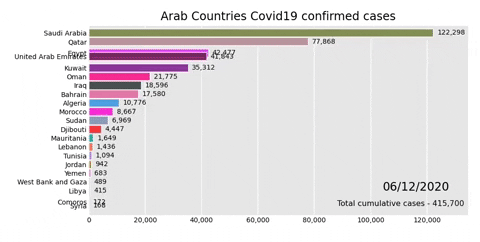

# covid19_visualization
This repo illustrates the increase of confirmed covid19 cases numbers allover the world.

## Examples:

#### Countries Cumulative Cases on World map 
 

#### Arab Countries Cumulative Cases

## Dependances 
* pip install geopandas==0.4.0
* pip install mapclassify
* pip install pysal==2.0.0
* pip install -U --no-deps mapclassify git+git://github.com/geopandas/geopandas.git@master
* pip install bar_chart_race

## Acknowledgements
* Johns Hopkins University for making the data available for educational and academic research purposes. 
